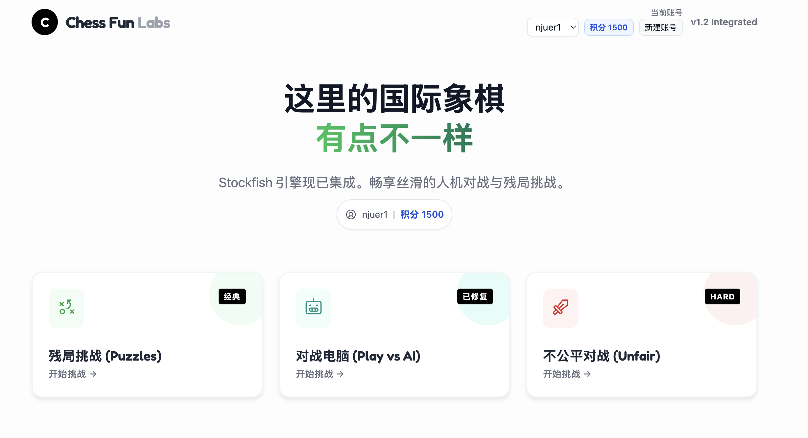
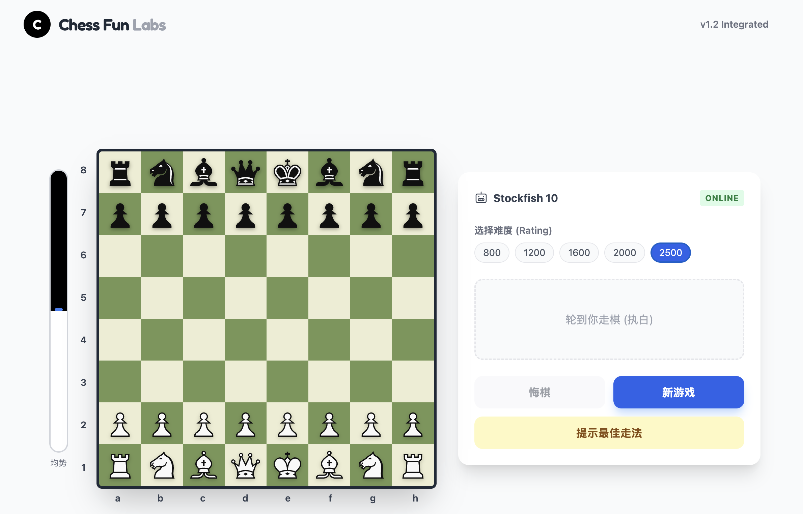

<!-- _class: lead -->
<!-- _backgroundImage: none -->
<!-- _backgroundColor: #fff -->

# ♟️ Chess Fun Labs
## AI 构建的轻量级国际象棋平台

**课程作业汇报**

2025-12-02 | 王彦翔

---

# 🎯 01. 项目背景与目标

### 核心目标
利用大模型 (LLM) 辅助开发，构建一个**零后端、即开即用**的 Web 国际象棋应用。

### 解决痛点
- **传统开发门槛**：编写象棋规则繁琐（如过路兵、王车易位、50步判和）。
- **现有竞品局限**：要么太重（需要注册下载），要么付费。
- **课程探索方向**：验证 AI 在复杂逻辑（UI + 算法 + 规则）开发中的协作能力与代码生成质量。

---

<!-- _class: white -->
<!-- _header: 成果展示 -->

# 🖥️ 02. 成果展示：模式选择

---

<!-- _class: white -->
<!-- _header: 成果展示 -->

# 🎮 03. 成果展示：对战界面 (Stockfish)

---

# 🧠 04. 技术栈与协作工具

- **语言 / 框架**: JavaScript + React 18 UMD + Tailwind CDN，单页直出。
- **大模型**: Gemini 3.0 Pro 负责代码生成与重构思路，Codex 做补全与微调。
- **Playwright MCP**: 通过 MCP 服务统一驱动浏览器自动化，免额外脚本依赖；同一会话内保持上下文，截图/表单/网络抓取一体化，便于回归验证 UI 交互。

---

# 🧩 05. 模式简介

- **残局闯关**: 选定 FEN 关卡，按脚本走对即可过关，支持提示与错误回滚。
- **人机对战**: 800~2500 五档 Stockfish，含评估条、悔棋与局面导入。
- **不公平模式**: 根据输局次数给玩家“升后”buff，降低上手门槛。

---

# 🎨 06. UI/UX 细节设计

- **交互反馈**: 落子音效 (Web Audio API)、拖拽高亮、Last Move 提示。
- **多平台适应**: 响应式布局覆盖桌面/平板/手机，触控与鼠标双模式。

---

# 🔮 07. 总结与展望

### 个人收获
- **降本增效**: 借助 LLM，更多精力放在玩法/体验设计与业务逻辑，少在样板代码与低级 debug 上反复；单页形态快速试错。
- **Playwright MCP 加速闭环**: 统一上下文的浏览器自动化让截屏、表单填充、网络抓取在同一会话完成，调试/回归无需额外脚本，验证体验变得可视、可复用。

### 未来计划
- [ ] **联机对战**: 引入 WebRTC 实现 P2P 局域网对战
- [ ] **棋谱分析**: 支持 PGN 棋谱导入导出
- [ ] **更多模式**: 增加 RTS式国际象棋
- [ ] **AI接入**: 接入常见LLM的API用于分析解释棋盘局势

---

<!-- _class: lead -->
<!-- _backgroundImage: none -->

# 谢谢大家！
## Q & A
